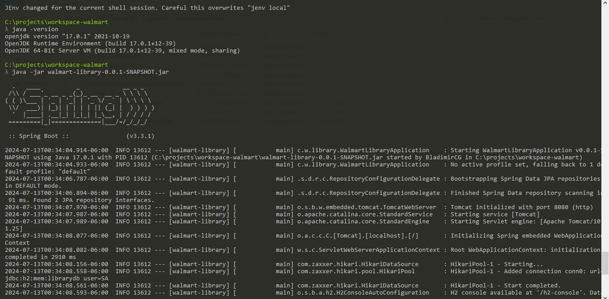
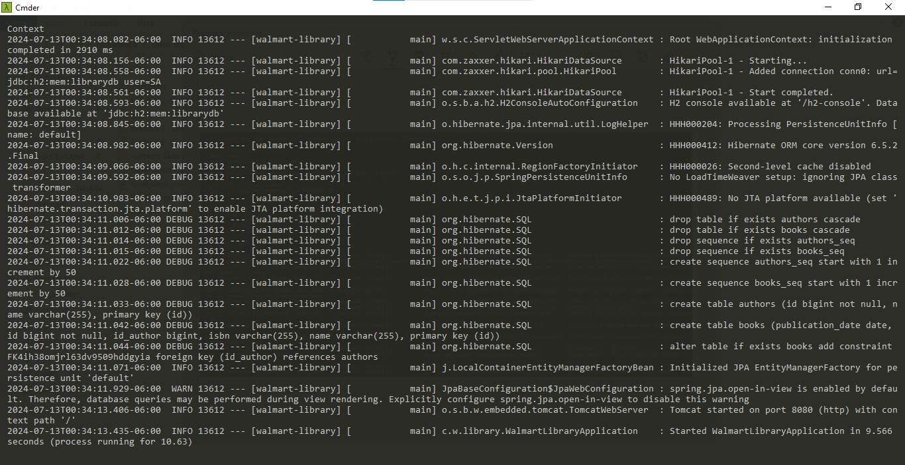

# Walmart - Library

## Stack
- Java 17
- Spring Boot 3.3.1
- Spring Data JPA
- [H2-cosole](http://localhost:8080/h2-console)
- Maven
- [Postman Collection](./Library.postman_collection.json)
- Eclipse
- [OpenApi-ui](http://localhost:8080/swagger-ui/index.html)

## Pre-requisites
Open JDK 17

## Run on Localhost Env
1. Clone the project from git-lab
[walmart-library](https://)
2. Run the App in your IDE the builded file
```shell
    java -jar walmart-library-0.0.1-SNAPSHOT.jar
```

## Reference

